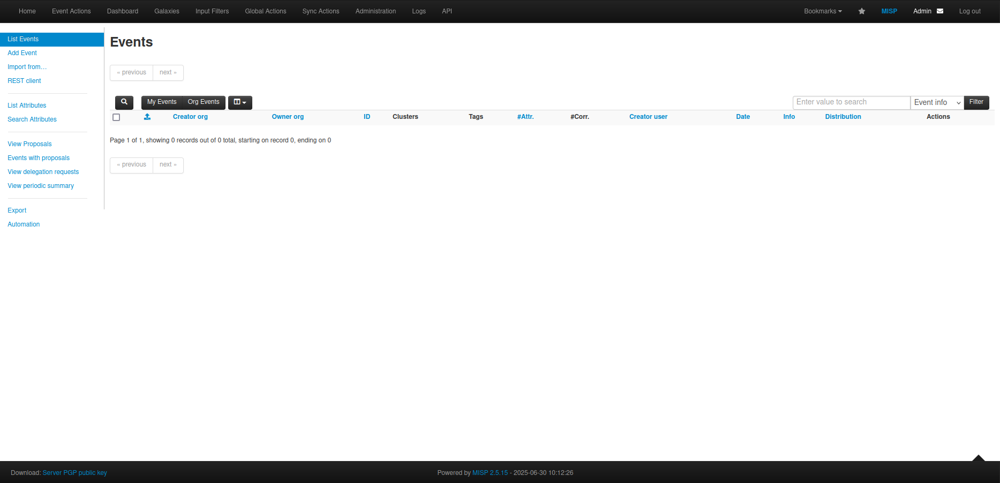

# Datalake MISP Integration

## Objective

This repository provides a connector that continuously retrieves threat intelligence from the Datalake platform and imports it into a MISP instance. The connector automates data ingestion, ensuring that the latest threat indicators are available for analysis and correlation within MISP.

## Prerequisites

Before setting up the connector, ensure you have the following:

- An operational MISP instance with the necessary privileges for reading and writing events.
- An active Datalake subscription. To authenticate, you can:
  - [Generate a Datalake Long-Term Token](https://datalake.cert.orangecyberdefense.com/gui/my-account)
  - Or use your Datalake account credentials (username and password)

## Getting started

The connector is provided as a [docker image](https://hub.docker.com/r/ocddev/datalake-misp-integration).
Here is a step by step process to download and run the image:

1. **Pull the Docker Image**
   Retrieve the latest version of the image by running:
   ```shell
   docker pull ocddev/datalake-misp-integration
   ```

2. **Configure Environment Variables**
   Copy the environment template and modify it with your credentials:
   ```shell
   cp template.env .env
   ```
   Edit the `.env` file to include:
   - Your Datalake authentication details (either Username & Password OR a Long-Term Token)
   - Your MISP instance host and API key

3. **Configure Queries**
   Copy the query template file and customize it to define your Datalake queries:
   ```shell
   cp template_queries.json queries.json
   ```
   Modify `queries.json` to add valid Datalake query hashes following the template's structure. For details on creating custom query hashes, refer to the Datalake documentation.
   The `frequency` key determines how often queries are executed. The first query execution doesn't trigger when the connector starts, so to test ingestion quickly, set `frequency` to a small value.

4. **Run the Container**
   Start the connector using the following command:
   ```shell
   docker run --env-file .env -v /path/to/queries.json:/code/queries.json ocddev/datalake-misp-integration
   ```

## Stopping the container

To stop the container gracefully, allowing the events to be fully inserted, use:
```shell
docker stop -t 120 <container_name>
```

## Testing the image with a local misp

For development and testing, you can set up a local MISP instance by following [the instruction of this repo](https://github.com/MISP/misp-docker#building-your-image)

Once your MISP is running at https://localhost, set the env variable `OCD_DTL_MISP_HOST` to `localhost` and get the MISP API key here: https://localhost/users/view/me for `OCD_DTL_MISP_API_KEY`.
Also, you may set the `OCD_DTL_MISP_USE_SSL` env variriable to `false` when working with a local MISP instance.

Then build and run the image with:
```makefile
make start-connector
```
When you're done using the connector, take it down with:
```makefile
make clean
```

## Testing the code

You can test the code with pytest using this command:
```makefile
make test
```
## Events in MISP


### Event description


### Event correlation graph


### Event history
