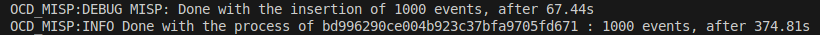

# Setting up the Datalake-MISP connector

The Datalake-MISP connector is a tool that continuously retrieves threat intelligence from the Datalake platform and imports it into a MISP instance. The connector automates data ingestion, ensuring that the latest threat indicators are available for analysis and correlation within MISP.

In this tutorial, you will set up the Datalake‑MISP connector for production use. At the end, you will also learn how to test it against a local MISP instance.

## Prerequisites

To set up and use the Datalake-MISP connector, you will need:

- Docker installed on your system. See Docker's [official install guide](https://docs.docker.com/get-docker/).
- A running MISP instance with API read/write privileges. You can [install it](https://misp.github.io/MISP/) on your machine or use a [dockerized version of MISP.](https://github.com/MISP/misp-docker)
- An active Datalake subscription, with rights to perform Advanced Searches and your Datalake username/password.


The MISP web interface should be accessible and look like this:

<p style="text-align:center"></p>

## Getting Your MISP Token

To ingest data into your MISP instance, you need an API Key. Here is how to create one from MISP's web interface:

   - Click your profile in MISP’s top‑bar.
   - Under **Auth keys**, click **Add authentication key**.
   - Select a user, you may set an expiration date, then click **Submit**.
   - Copy and store this token securely.

<p style="text-align:center"></p>


## Running the Connector

The connector will run inside of a Docker container. To set it up, we first need to retrieve both the connector's Docker image and the connector's repository.

### 1. **Pull the Docker Image**
   
   Pull the latest Docker image with:
   ```shell
   docker pull ocddev/datalake-misp-integration
   ```

### 2. **Pull the Repository**
   
   This repository contains the connector code and configuration.
   Navigate to the directory where you want to clone the repository and run:
   ```shell
   git clone https://github.com/cert-orangecyberdefense/datalake_misp_integration.git
   ```


### 3. **Configure Environment Variables from the repository**
   
   Inside the datalake_misp_integration folder you just pulled, copy the environment template with:
   ```shell
   cp template.env .env
   ```
   Edit the `.env` file and fill in the variables. The minimal information required is summarized in the table below

   | **Variable**                      | **Description**                                                               |
   | --------------------------------- | ----------------------------------------------------------------------------- |
   | `OCD_DTL_USERNAME`                | Datalake account username                                                     |
   | `OCD_DTL_PASSWORD`                | Datalake account password                                                     |
   | `OCD_DTL_API_ENV`                 | Datalake environment to query: `prod` (default) or `preprod`                  |
   | `OCD_DTL_MISP_API_KEY`            | API token for your MISP user account                                          |
   | `OCD_DTL_MISP_HOST`               | URL of the MISP instance (must include `https` unless using local test setup) |
   | `OCD_DTL_MISP_USE_SSL`            | Enable/disable SSL verification (`true` or `false`)                           |
   | `OCD_DTL_QUOTA_TIME`              | Time window in seconds for rate-limiting quota                                |
   | `OCD_DTL_REQUESTS_PER_QUOTA_TIME` | Maximum number of API requests within the quota window                        |
   | `OCD_DTL_MISP_MAX_RESULT`         | Maximum number of Indicator Of Compromise (IOC) to transfer per execution       |
   | `OCD_DTL_MISP_WORKER`             | Number of parallel worker processes                                           |
   | `OCD_DTL_QUERY_CONFIG_PATH`       | Path to the query config file inside the container                            |

   A full `.env` should look like this:

   ```env
   OCD_DTL_USERNAME=cti-ops+demo@orangecyberdefense.com
   OCD_DTL_PASSWORD=demo_password
   OCD_DTL_QUOTA_TIME=10
   OCD_DTL_REQUESTS_PER_QUOTA_TIME=10
   OCD_DTL_API_ENV=prod
   OCD_DTL_MISP_MAX_RESULT=1000
   OCD_DTL_MISP_API_KEY=xx8IEcacmJtrzePGGhGG2V6TXthJsDfFH1CbcQ6D
   OCD_DTL_MISP_HOST=https://orangecyberdefense.com/demo/misp_instance
   OCD_DTL_MISP_USE_SSL=true
   OCD_DTL_MISP_WORKER=4
   OCD_DTL_QUERY_CONFIG_PATH=/code/queries.json
   ```

### 4. **Configure Queries**
   
   This step determines which IOCs will be transferred from Datalake to MISP. For our example, let's import IPs from peerpressure that have a malware score greater than 80. On Datalake's web interface, we input the following filters:

   <p style="text-align:center"></p>

   With this search, the associated query hash is shown in the url:

   ```url
   https://datalake.cert.orangecyberdefense.com/gui/search?query_hash=bd996290ce004b923c37bfa9705fd671
   ```

   The hash `bd996290ce004b923c37bfa9705fd671` uniquely identifies your saved search.
   
   After retrieving the query hash, we can configure the connector to use it.
   Inside the datalake_misp_integration folder, copy the `template_queries.json` file:

   ```shell
   cp template_queries.json queries.json
   ```

   Then, we can manually modify `queries.json` to set our query hash like so:

   ```json
   {
     "queries": [
       {
         "query_hash": "bd996290ce004b923c37bfa9705fd671",
         "frequency": "6h"
       },
       {
         "query_hash": "<second_query_hash>",
         "frequency": "<second_frequency>"
       }
     ]
   }
   ```
   You may add as many different query hashes as you like.

   The `frequency` key determines how often each query is executed. Note that queries do not run immediately when the connector starts — the first execution will happen after the specified interval. You can specify frequency in seconds (s), minutes (m), or hours (h)

### 5. **Run the Container**
   
   When everything is set up, you may start the connector inside the datalake_misp_integration folder:
   ```shell
   docker run --env-file .env -v queries.json:/code/queries.json ocddev/datalake-misp-integration
   ```

## Verifying the import

When the connector starts, it should automatically ingest data to the MISP instance. The transfer may take several minutes depending on the size of the request. With OCD_DTL_MISP_MAX_RESULT set to 1000, we obtain this result: 

<p style="text-align:center"></p>

Here you can see the new events imported under Event Actions → List Events.

<p style="text-align:center"></p>

Clicking on any Event's ID lets us explore the information related to this IOC.

<p style="text-align:center"></p>

MISP also allows to make requests about those Events under API -> REST API.


## Test the connector with a local MISP instance

This is meant for development and testing. To launch the connector for a local MISP instance, the procedure differs slightly from the one above meant for production.
Firstly, you need to set up a MISP running and accessible from your localhost by following [the instruction of this repo](https://github.com/MISP/misp-docker#building-your-image).

Once this is set up, the web interface should be available at [https://localhost](https://localhost).

At this point, you can follow all 5 steps of the [Running the Connector](#running-the-connector) section of the tutorial above, with slight variations for steps 3 and 5:

For step 3:
Set the env variable `OCD_DTL_MISP_HOST` to `localhost` and get the MISP API key here: https://localhost/users/view/me for `OCD_DTL_MISP_API_KEY`.
Also, you may set the `OCD_DTL_MISP_USE_SSL` env variable to `false` when working with a local MISP instance.

For step 5:
The command for running the connector on a local instance is the following:
```shell
docker build -t misp_push . && docker run --env-file .env --net=host misp_push
```

## Troubleshooting

Here are some common errors you might encounter when launching the container

**Error: Missing Environment Variable**

```
Traceback (most recent call last):
  File "/code/main.py", line 21, in <module>
    datalake = Datalake()
  File "/code/src/datalake.py", line 21, in __init__
    endpoint_config, _, tokens = BaseScripts().load_config(args=args)
  File "/home/pythonuser/.local/lib/python3.9/site-packages/datalake_scripts/common/base_script.py", line 87, in load_config
    token_json = token_generator.get_token()
  File "/home/pythonuser/.local/lib/python3.9/site-packages/datalake_scripts/common/token_manager.py", line 31, in get_token
    username = os.getenv('OCD_DTL_USERNAME') or input('Email: ')
EOFError: EOF when reading a line
```

This error might occur when a necessary environment variable is missing or in the wrong format. Compare yours to [this example](#3-configure-environment-variables-from-the-repository).

**Error: Invalid Query Hash**

```
API returned non 2xx response code : 404
{"message":"Advanced Query does not exist"}
```

This error means the query hash is not recognized. Ensure it exists in the specified Datalake environment. Check that your variable OCD_DTL_API_ENV is correctly specified (default is prod)

**Error: MISP Connection Failed**

```
Traceback (most recent call last):
  File "/code/main.py", line 22, in <module>
    misp = Misp()
  File "/code/src/misp.py", line 17, in __init__
    self.misp_backend = pymisp.ExpandedPyMISP(
  File "/home/pythonuser/.local/lib/python3.9/site-packages/pymisp/__init__.py", line 68, in __init__
    super().__init__(*args, **kwargs)
  File "/home/pythonuser/.local/lib/python3.9/site-packages/pymisp/api.py", line 247, in __init__
    raise PyMISPError(f'Unable to connect to MISP ({self.root_url}). Please make sure the API key and the URL are correct (http/https is required): {e}')
pymisp.exceptions.PyMISPError: Unable to connect to MISP (http://localhost). Please make sure the API key and the URL are correct (http/https is required): HTTPSConnectionPool(host='localhost', port=443): Max retries exceeded with url: /servers/getVersion (Caused by SSLError(SSLCertVerificationError(1, '[SSL: CERTIFICATE_VERIFY_FAILED] certificate verify failed: self signed certificate (_ssl.c:1129)')))
```

For local testing only, disable SSL verification by setting: OCD_DTL_MISP_USE_SSL=false. Do not use this setting in production.